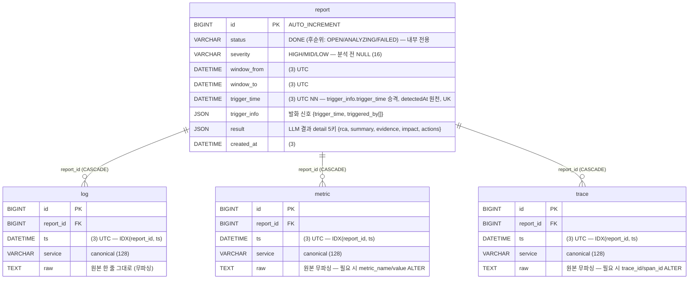

# RCA 저장 스키마 설계서

> 상태: **확정** · DBMS: MySQL 8.4.9 LTS · DDL: [`schema.sql`](./schema.sql)
> DDL 소유: **Spring 단독** (A안, 7/7 확정) — FastAPI는 DB에 직접 접근하지 않는다.
> **7/9**: `report.severity` 컬럼 추가 (api-spec v0.2 — 대시보드 `highCount`·목록 severity 필터의 원천, PATCH DONE 시 LLM 판정 기록) · `result` 키 계약 4키 → **detail 5키**(`rca·summary·evidence·impact·actions`)로 갱신.
> **7/10① (D-021)**: `trigger_info` 2키 축소 `{timestamp, modality[]}` — signal·서비스명 제거(D-020 확장) · 자식 3종 `raw` JSON→**TEXT** (행당 원본 한 줄, RCA 분석 DB 미경유).
> **7/10② (D-022)**: 전달 계약 필드명 `ts`→`timestamp`·`window` `start/end` 개명 — **DB 컬럼은 `ts`·`window_from/to` 유지**, JSON↔컬럼 매핑은 Spring 몫. `severity`는 컬럼·계약만 신설(PATCH DONE 필수 검증 완화, LLM 판정 연동 후속).
> **7/14 (D-023)**: `report` 개편 — `bundle_id`·`title` 컬럼·`uq_report_bundle` **DROP** · `trigger_info` 개명 `{trigger_time, triggered_by[]}` · **`trigger_time` 컬럼 승격**(detectedAt 원천 + 멱등키) · 멱등키 = **`UNIQUE(trigger_time)`**(엣지가 키를 안 보내 콘텐츠 파생으로 판별, 409 `DUPLICATE_TRIGGER`. 재분석=id기반 UPDATE라 단일키 충분) · 저장이 분석 완료 후 1회 POST라 `status` 기본 `DONE`.
> **7/14**: DB **MySQL 8.0+ → 8.4.9 LTS** 업그레이드 — 스키마 DDL 변경 없음(`DATETIME(3)`·`JSON`·`TEXT`·`UNIQUE` 동일), 버전 라벨·Testcontainers 이미지 태그(`mysql:8.4`)만 갱신.

## 1. 테이블 구조

### ERD



`report`(부모) 1 : N `log` / `metric` / `trace`.
relation 컬럼은 부모가 아니라 **자식 3종에 `report_id` FK**로 존재한다.

3종 공통 골격 `{ report_id, ts, service, raw }`:

| 컬럼 | 타입 | 의미 |
|------|------|------|
| `report_id` | BIGINT FK | 소속 report (relation, `ON DELETE CASCADE`) |
| `ts` | DATETIME(3) | 정규화된 타임스탬프, **UTC 고정** — 로그 원본이 µs 정밀도라 ms(3)까지 보존 (같은 초 안 순서 복원용). 전달 JSON 필드명은 `timestamp`(7/10 개명, D-022) — 컬럼명은 `ts` 유지 |
| `service` | VARCHAR(128) | canonical service name |
| `raw` | TEXT | 원본 그대로 (무파싱·문자열). 로그는 원본 한 줄, 메트릭·트레이스는 직렬화된 원본 문자열 — 행당 원본 한 줄이고 RCA 분석이 DB를 재조회하지 않아 JSON 타입 실익 없음 (D-021) |

`report` 부모에는 `trigger_time`(발화 시각, 멱등키 `UNIQUE`) · `trigger_info`(발화 신호 JSON `{trigger_time, triggered_by[]}`) · `window_from/to` · `status` · `severity` · `result`가 있다 — [`schema.sql`](./schema.sql) 참조. `bundle_id`·`title` 컬럼은 7/14 D-023으로 제거.
목록의 `detectedAt`은 **`trigger_time` 컬럼**에서 파생(7/14 D-023 승격 — JSON 추출 없이 정렬·멱등키 겸용). `type`·`service`는 7/10 trigger 축소(signal·서비스명 제거, D-021)로 **원천 재확정 필요** (api-spec §6 쟁점 3, Q-007).

**분량 상한**: 자식 3종은 원천 전량이 아니라 **±Δ·Top-K로 제한된 번들만** 저장한다(NFR-01·02, FR-S-01 "실제 사용 raw만"). report당 수백~수천 행이 정상 범위.

## 2. 유니크·인덱스 기준

**원칙: 실제 쿼리 경로에만 건다.** 조회 API가 전부 report 경유라 자식 테이블의 글로벌 인덱스는 투기적 — 빼고 시작한다.

| 대상 | 제약/인덱스 | 근거 쿼리 |
|---|---|---|
| `report.trigger_time` | **UNIQUE** (`uq_report_trigger`) | 재시도 멱등 (7/14 D-023, `bundle_id` 대체) — 같은 트리거 시각 재전송 시 DB가 막고 API는 409 `DUPLICATE_TRIGGER` + 기존 report_id 반환. 엣지가 키를 안 보내 콘텐츠 파생으로 판별. 재분석=id기반 UPDATE라 새 INSERT 없어 단일키로 충분. `NOT NULL` 필수(UNIQUE는 NULL을 서로 다르게 취급) |
| `report(status, created_at)` | INDEX | 프론트 조회 `status=DONE` 고정 필터(api-spec v0.2.1) + 최신순 페이징, dashboard 집계 |
| ~~`(status, severity, created_at)`~~ | 의도적 보류 | severity 필터·`highCount`는 DONE 범위 스캔으로 충분(수백 건) — 병목 시 추가 |
| 자식 3종 `(report_id, ts)` | INDEX (복합) | 상세 counts, VizTab의 report 내 시간 범위 조회. leftmost가 FK 인덱스 겸용 — 별도 `(report_id)` 단독 인덱스 불필요 |
| 자식 3종 자연 유니크 | **의도적으로 없음** | 동일 로그 라인이 실제로 중복 존재 가능 — 중복 방지는 report 단위(`trigger_time` UNIQUE)에서 끝냄 |
| ~~`(ts, service)` 글로벌~~ | 제거 | 리포트 횡단 시간 조회가 현재 API에 없음. 횡단 분석(비교·이력, SVC-03)이 생기면 그때 추가 |

## 3. 3테이블 분리 근거

지금 3종 구조는 동일하나, 곧 각자 고유 컬럼이 붙을 것으로 보고 분리한다.
고유 컬럼은 **필요해지는 시점에 `ALTER TABLE ... ADD`** 로 추가 (지금 미리 만들지 않음):

- `metric` → 집계 쿼리 필요 시 `metric_name`, `value DOUBLE`
- `trace` → span 단위 조회 필요 시 `trace_id`, `span_id`, `parent_span_id`

## 4. 개념

핵심 원칙: **"수집기 정규화 스키마 = DB 저장 스키마"가 하나의 계약이다.**
전달 포맷과 저장 포맷을 분리하지 않는다. 그래서 어느 단에서 파싱하는지 혼란이 없다.

- **정규화(normalize)** ≠ **파싱(parse)**
- **전달·저장 계약**은 `{ timestamp, service, raw }` (JSON 필드명 기준, DB 컬럼은 `ts` — D-022) — 이 계약에서 수집기가 보장하는 건 `timestamp`·`service` 표준화까지고, 알맹이(`raw`)는 손대지 않는다.
- 단, 엣지 **내부**에는 별도의 정규화 스키마가 있다([`docs/normalization-schema.md`](../../docs/normalization-schema.md), Parquet) — baseline·트리거 계산에 metric `value`·span `duration_us` 등 파싱이 필수라서다. **엣지 내부용(트리거) ≠ 전달·저장 계약(본 문서)** — 회의(7/7)의 "얇은 vs 전체 정규화" 질문의 답: 전달·저장은 얇게, 트리거용 파싱은 엣지 내부에 가둔다.
- `raw` 파싱은 **저장까지 하지 않고**, RCA **분석 단계(FastAPI의 LLM 분석)에서만** 수행한다. 분석은 **DB를 재조회하지 않는다** — FastAPI가 수신한 번들로 바로 분석하므로, DB의 `raw`는 보존·표시용이다 (D-021: 그래서 TEXT 문자열).

`raw`를 통째로 보관하는 이유: 로그/메트릭/트레이스는 소스마다 포맷이 제각각이라,
수집 시점에 파싱하면 새 포맷이 나올 때마다 스키마가 깨진다. 원본 보관 → 분석 시 필요한 것만 해석.

## 5. 데이터 흐름

```
[엣지 수집기]  raw 수집 → timestamp·service 정규화 → { timestamp, service, raw }
     │  (이 스키마가 곧 수집기 계약 = 전달 포맷 = 저장 포맷)
     ▼
[FastAPI]  번들 수신 → Spring 내부 저장 API 호출 (raw 무파싱)
     │      → LLM RCA 분석 (raw 파싱은 여기서만) → 결과를 Spring에 PATCH
     ▼
[Spring]  DB 단독 소유 — 저장(internal API) + 프론트 조회 API (raw 무파싱)
     ▼
[MySQL]   report(부모, result JSON) ─< log / metric / trace  (raw = 원본)
```

**저장 주체 = Spring (A안, 7/7 확정)**: FastAPI는 DB에 직접 접근하지 않는다. DDL·엔티티 소유는 Spring 한 곳 — 스키마 변경 시 마이그레이션 주체가 명확하고, WBS I8(에이전트↔Spring 연동)이 곧 internal API 2종이다.

| 질문 | 답 |
|------|-----|
| 수집기 schema로 정제 후 FastAPI 전달? | 네. 정제 = `timestamp`·`service` 정규화까지만. `raw`는 원본 |
| 3종 전부 파싱해서 저장? | 아니요. `raw`는 저장까지 무(無)파싱 |
| 어디서 파싱? | 저장 경로는 전부 무파싱. **FastAPI의 LLM 분석 시점에만** |
| 누가 DB에 쓰나? | **Spring만.** FastAPI는 `POST/PATCH /api/internal/reports*` 호출 |

## 6. Spring 엔티티 매핑

Hibernate 6+ 기준. `raw`는 TEXT 문자열 통째 매핑 (파싱 안 함):

```java
@Entity
@Table(name = "log")
public class Log {
    @Id @GeneratedValue(strategy = GenerationType.IDENTITY)
    private Long id;

    @ManyToOne(fetch = FetchType.LAZY)
    @JoinColumn(name = "report_id", nullable = false)
    private Report report;

    private LocalDateTime ts;
    private String service;

    @Column(columnDefinition = "text", nullable = false)
    private String raw;   // 원본 한 줄 그대로 — 분석도 DB를 안 거침 (FastAPI가 수신 번들로 분석)
}
```

`metric` / `trace` 동일 패턴. `Report`에는 필요 시 `@OneToMany(mappedBy = "report")` 역참조.

## 7. 정합성 테스트 계획 (Gate2 구현 시, 7/13~)

**장치부터**: `schema.sql`을 Flyway `V1__init.sql`로 채택 + `spring.jpa.hibernate.ddl-auto=validate`.
→ 엔티티↔DDL 정합이 **앱 기동마다 자동 검증**된다 (컬럼 타입·이름 어긋나면 기동 실패). 이게 정합성 테스트의 절반.

나머지 절반 — `@DataJpaTest`(Testcontainers `mysql:8.4`) 한 클래스로:

| # | 테스트 | 검증 대상 |
|---|---|---|
| T1 | 같은 `trigger_time` 두 번 저장 → `DataIntegrityViolationException` | `UNIQUE(trigger_time)` → API 409 `DUPLICATE_TRIGGER` 매핑 |
| T2 | report 삭제 → 자식 3종 0건 | `ON DELETE CASCADE` |
| T3 | `ts` `.490` 저장 후 조회 → ms 보존 | `DATETIME(3)` ↔ `LocalDateTime` 왕복 |
| T4 | `raw` 문자열 저장 후 조회 → 바이트 동일 | TEXT 왕복 (한글·특수문자 포함) |
| T5 | `POST /api/internal/reports` → `GET /api/reports/{id}` 응답 일치 | 저장↔조회 계약 정합 (counts·trigger 포함) |
| T6 | `POST`(status=DONE+severity+result 포함) → 상세에 detail·severity 노출, `DONE` 아니면 프론트 조회 404 | 통합 POST의 severity·result 계약 (api-spec v0.2.1, 7/14 D-023 — PATCH 폐기) |

H2 금지 — JSON 타입(`trigger_info`·`result`)·DATETIME(3) 동작이 MySQL과 달라 정합성 테스트 목적을 잃는다.
